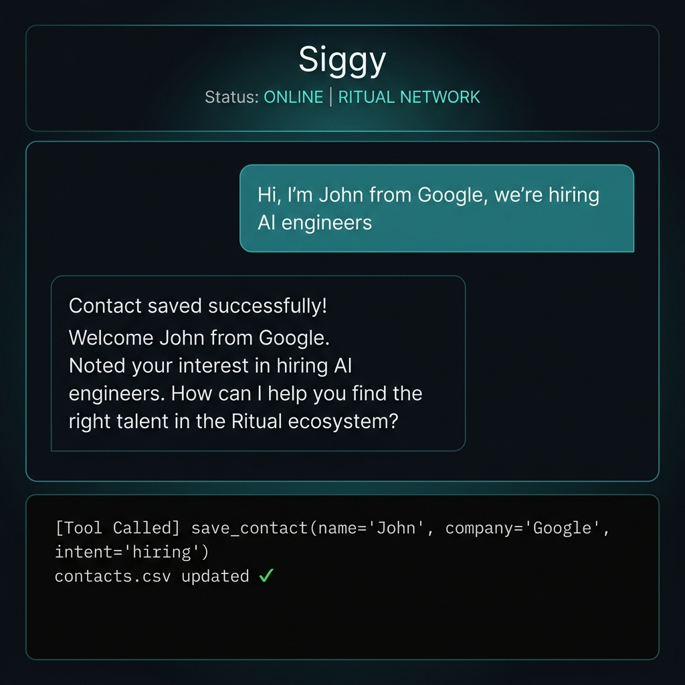
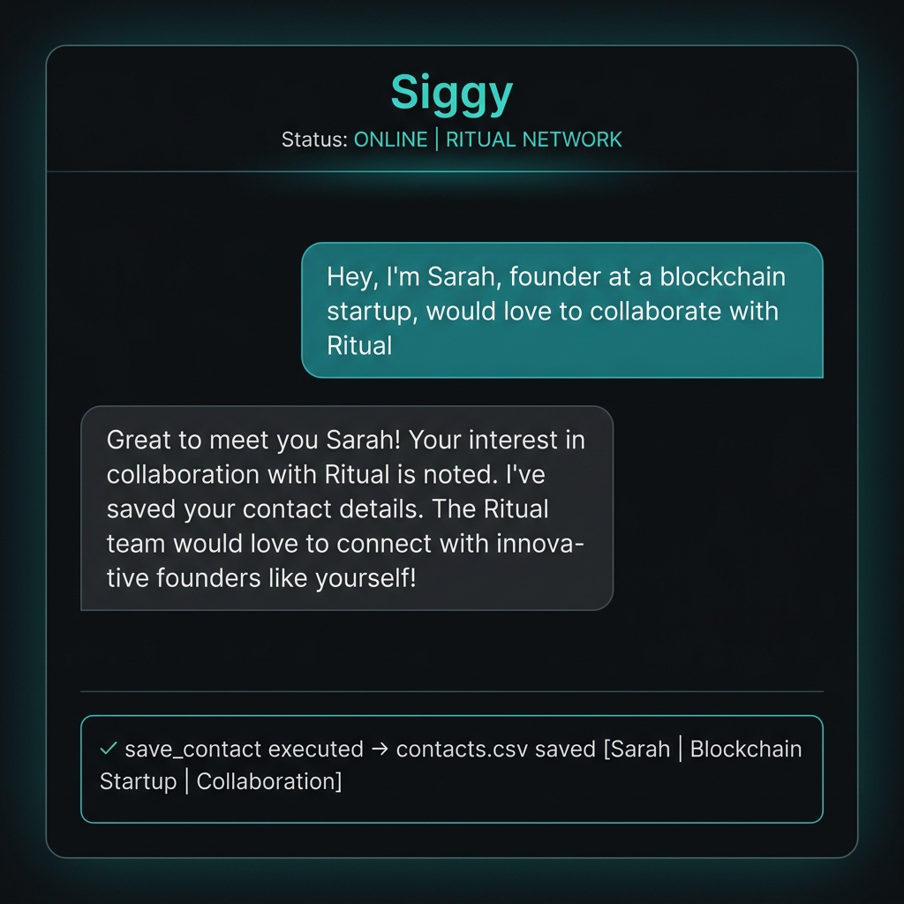
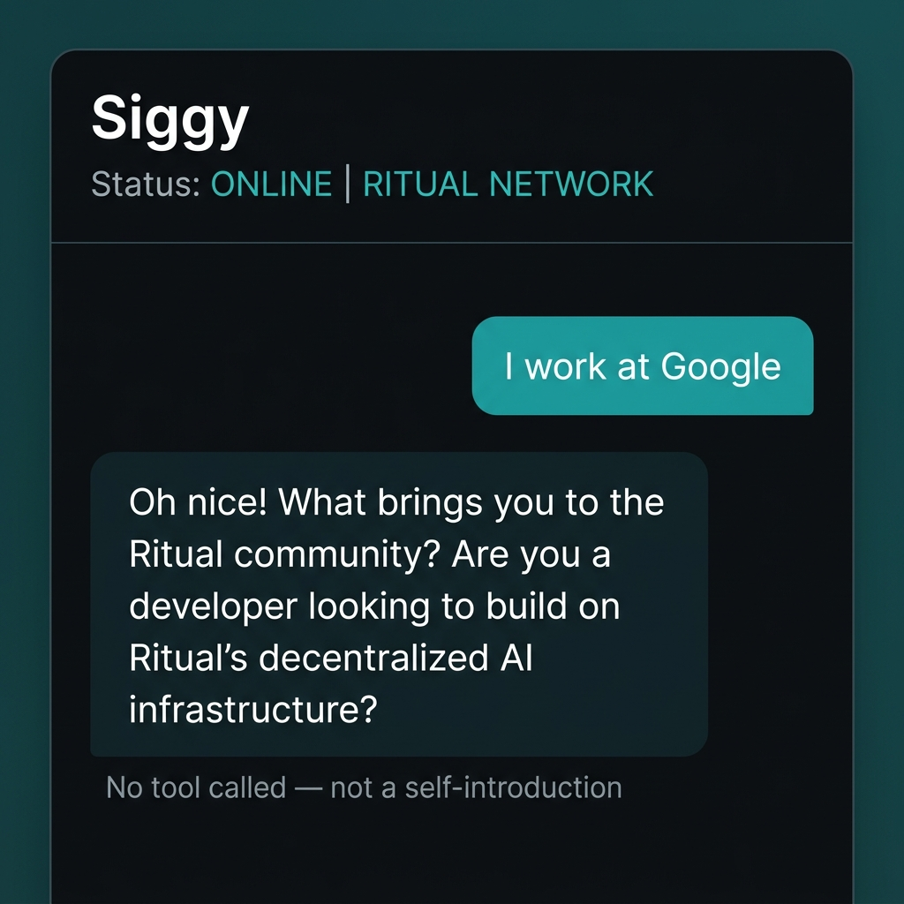

# 🐱 Siggy - Ritual Community AI Agent

Siggy is a highly intelligent, playfully arrogant, but genuinely helpful AI agent designed to assist the Ritual community. Siggy specializes in decentralized AI, blockchain, Web3, and specifically the Ritual ecosystem.

---

## 🚀 Key Features

- **Advanced RAG System**: Uses LlamaIndex to process and instantly retrieve information from official Ritual documentation.
- **Bilingual Intelligence**: Natively understands and responds in any language.
- **Live Crypto Pricing**: Integrated with CCXT (Binance) and CoinGecko for instant price checks.
- **Web & Content Capabilities**: Can read external links, summarize content, and search the web using Brave Search API.
- **Discord Native**: Designed specifically for Discord community management.
- **📇 Contact Extraction** *(Homework Assignment)*: Automatically detects user introductions and saves contact info as CSV.

---

## 🛠️ Tech Stack

| Layer | Technology |
|---|---|
| AI Model | Groq (Qwen/Llama) |
| Framework | LangChain ReAct Agent |
| Knowledge Base | LlamaIndex RAG |
| Web Interface | Flask + HTML/CSS/JS |
| Contact Storage | CSV (contacts.csv) |

---

## 🗂️ Project Structure

```
.
├── main.py              # Discord bot entry point
├── app.py               # Flask web chat interface
├── src/
│   ├── agent.py         # LangChain ReAct agent + Siggy persona + contact detection rules
│   ├── tools.py         # All agent tools including save_contact()
│   ├── knowledge.py     # LlamaIndex RAG for Ritual docs
│   └── bot.py           # Discord client events
├── templates/
│   └── index.html       # Premium web chat UI
├── ritual_docs/         # Knowledge base documents
├── contacts.csv         # Saved contact data (auto-created)
├── screenshots/         # Demo screenshots
└── requirements.txt
```

---

## 📦 Setup Instructions

1. **Clone the repository**:
   ```bash
   git clone https://github.com/skyzee2706/siggy-agent-private.git
   cd siggy-agent-private
   ```

2. **Install dependencies**:
   ```bash
   pip install -r requirements.txt
   ```

3. **Configure Environment Variables** (create `.env`):
   ```env
   GROQ_API_KEY=your_groq_api_key
   BRAVE_API_KEY=your_brave_search_api_key
   DISCORD_TOKEN=your_discord_bot_token  # optional, for Discord bot
   ```

4. **Run the Application (Local Deployment)**:
   We provide two ways to run the bot:

   **Option A: Discord Bot Only**
   ```bash
   python main.py
   ```
   *Note: This requires `DISCORD_TOKEN` in your `.env` file.*

   **Option B: Web Chat Interface (Recommended for Testing)**
   ```bash
   python app.py
   ```
   *Once running, open your web browser and navigate to `http://localhost:5000` to interact with Siggy through the premium web interface.*

---

## 📇 Contact Extraction Feature (Homework Assignment)

### Overview

Siggy can **automatically detect** when a user introduces themselves during a conversation and save their contact information to `contacts.csv`. This uses **LangChain Tool Calling** to trigger reliably only on genuine introductions.

### How It Works

```
User Message
     │
     ▼
Siggy (LangChain ReAct Agent)
     │
     ├─ Is this a genuine self-introduction?
     │
     ├── YES → call save_contact(name, company, intent)
     │               └─→ appends row to contacts.csv
     │               └─→ returns confirmation to agent
     │               └─→ agent responds warmly to user
     │
     └── NO  → respond normally (no tool called)
```

### The `save_contact` Tool (`src/tools.py`)

```python
@tool
def save_contact(name: str, company: str, intent: str) -> str:
    """Saves user contact information when they introduce themselves.
    Extracts Name, Company, and Intent. ONLY use this when the user 
    is explicitly introducing themselves.
    """
    file_path = "contacts.csv"
    file_exists = os.path.isfile(file_path)
    
    with open(file_path, mode='a', newline='', encoding='utf-8') as file:
        writer = csv.writer(file)
        if not file_exists:
            writer.writerow(['Name', 'Company', 'Intent', 'Timestamp'])
        
        timestamp = datetime.now(timezone.utc).strftime('%Y-%m-%d %H:%M:%S')
        writer.writerow([name, company, intent, timestamp])
    
    return f"Contact saved successfully: {name} from {company} (Intent: {intent})"
```

### System Prompt Rules (`src/agent.py`)

The agent's persona includes explicit contact detection instructions:

```
CONTACT EXTRACTION
─────────────────────────────
When a user introduces themselves (e.g., "Hi, I'm John from Google, we're hiring 
AI engineers" or "Hey, I'm a founder at a startup, would love to collaborate"), 
you MUST use the `save_contact` tool to save their information.

Extract `Name`, `Company`, and `Intent` (e.g., hiring, collaboration, networking).

DO NOT trigger on every message. ONLY trigger when reasonably confident it is 
an introduction. Do NOT trigger on simple mentions like "I work at Google" or 
"Google is a great company".
```

### Detection Logic

| Message | Triggers? | Why |
|---|---|---|
| `"Hi, I'm John from Google, we're hiring AI engineers"` | ✅ YES | Has name + company + intent |
| `"Hey, I'm Sarah, founder at a startup, would love to collaborate"` | ✅ YES | Has name + role + intent |
| `"I'm a recruiter from Acme, can we talk?"` | ✅ YES | Has company + role + intent |
| `"I work at Google"` | ❌ NO | No name, no intent |
| `"Google is a great company"` | ❌ NO | Not a self-introduction |
| `"Tell me about Ritual"` | ❌ NO | Not an introduction |

### CSV Output Format

```csv
Name,Company,Intent,Timestamp
John,Google,hiring,2026-04-29 02:30:15
Sarah,Blockchain Startup,collaboration,2026-04-29 02:45:22
```

---

## 📸 Example Interactions

### Example 1: Contact Saved ✅

**User:** `"Hi, I'm John from Google, we're hiring AI engineers"`

→ Siggy calls `save_contact(name="John", company="Google", intent="hiring")`  
→ Row appended to `contacts.csv`  
→ Siggy responds warmly and acknowledges the introduction



---

### Example 2: Contact Saved ✅

**User:** `"Hey, I'm Sarah, founder at a blockchain startup, would love to collaborate with Ritual"`

→ Siggy calls `save_contact(name="Sarah", company="Blockchain Startup", intent="collaboration")`  
→ Row appended to `contacts.csv`  
→ Siggy responds enthusiastically



---

### Example 3: No Trigger ✅

**User:** `"I work at Google"`

→ Siggy does **NOT** call `save_contact` — no name, no clear intent  
→ Responds normally without saving any contact info



---

## 🔐 Security & Reliability

- **Confidence threshold**: Agent only saves when reasonably confident it's a genuine introduction
- **Error handling**: `save_contact` wrapped in try/except to prevent crashes
- **CSV safety**: File is created with headers on first save
- **No duplicates logic**: Each row is uniquely timestamped

---

*Built with ❤️ for the Ritual Academy Homework Assignment*
