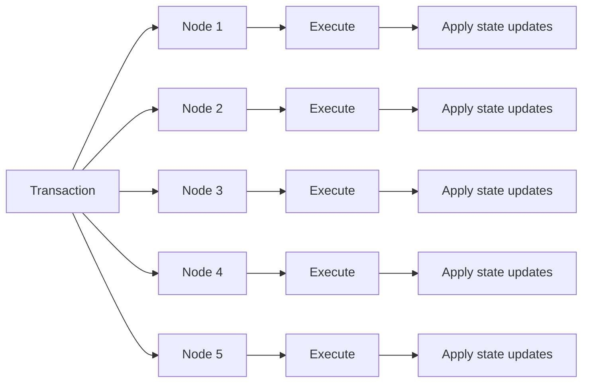
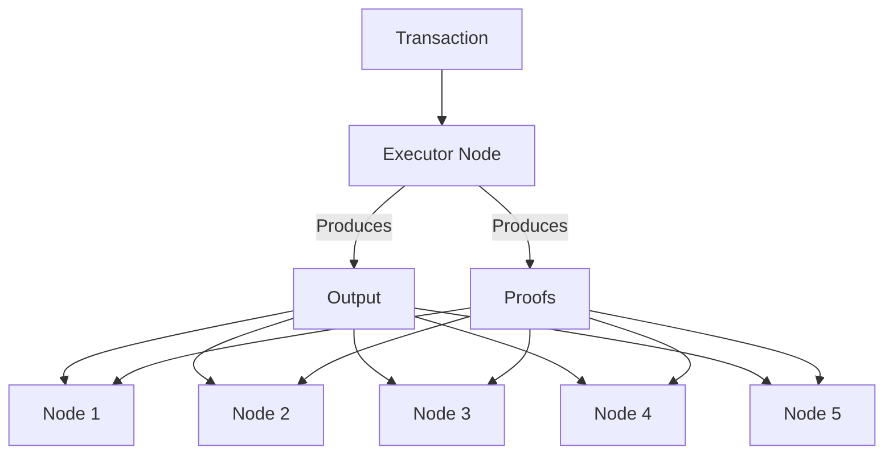

> ## Documentation Index
> Fetch the complete documentation index at: https://ritualfoundation.org/docs/llms.txt
> Use this file to discover all available pages before exploring further.

# Symphony

> Symphony is a new consensus protocol to reduce replicated execution and enable high-performance, resource-intensive workloads.

export const Spacer = ({gap}) => 

;

<Info>
  To read in-depth about Symphony architecture, reference the [architecture
  page](/architecture/symphony).
</Info>

<Frame>
  <video src="https://mintcdn.com/ritualfoundation/sxqQxm2wyqht7Z65/assets/videos/symphony.mp4?fit=max&auto=format&n=sxqQxm2wyqht7Z65&q=85&s=bcfa4989545b0538c83c2179cb1cfacb" autoPlay controls disablePictureInPicture loop playsInline muted preload="auto" data-path="assets/videos/symphony.mp4" />
</Frame>

***

## Existing consensus protocols

Most blockchains today operate on a simple principle: **replicated execution**,
where all nodes re-execute each block to achieve two goals:

1. Verify transactions through re-execution
2. Compute and apply state updates to their local state

This model has traditionally worked well because most computations were simple
and had homogeneous resource consumption (e.g., basic arithmetic operations or
hash functions).

<Spacer gap={50} />

<Spacer gap={50} />

<Warning>
  With Ritual's heterogeneous, resource-intensive workloads, such replicated
  execution across all validator nodes becomes **redundant, inefficient, and
  unscalable**.
</Warning>

***

## Symphony

To address this heterogeneous workload challenge, we developed an optimized
execution and verification model via a new consensus protocol, dubbed Symphony.

Symphony builds upon an **Execute-Once-Verify-Many-Times (EOVMT)** model by
which select compute nodes act as **sole executors** of workloads, generating
succinct sub-proofs for executed compute.

***

### Execute Once

Ritual executes inference SPC opcodes externally to the EVM, with the resulting
outputs seamlessly integrated back into the EVM. Inference SPC opcodes can take
several minutes and even hours to execute, and synchronously processing them in
a replicated fashion would drastically increase block times, potentially
bringing block production to a halt and severely impacting the chain's
performance and liveness.

**To address this, we adopt an `Execute-Once` model for inference opcodes.**

In this approach, these opcodes are executed asynchronously off-chain by
selected compute nodes in a specialized environment.

To eliminate the need for verification of off-chain computations through
replicated execution, we use succinct proofs that can be efficiently verified by
validators.

Notably, since SPC opcode execution and proof generation occur asynchronously
off-chain, **proof generation does not impact the on-chain critical path**.

<Note>
  Ritual prioritizes prover-friendly systems with linear or near-linear proof
  generation time, closely aligning with the execution's complexity.
  Additionally, prover time can be further optimized through techniques such as
  parallel proof generation using multi-core or multi-machine setups.
</Note>

With this `Execute-Once` semantic, inference opcodes are executed once by the
designated compute node, and validators efficiently verify the proofs to accept
the results, without redundant re-execution.

<Spacer gap={50} />

***

### Verify Many Times

Although `Execute Once` addresses the unscalability of replicated execution,
verifying proofs for complete model inference opcodes poses significant
scalability challenges.

<Warning>
  While the proofs are succinct, their sizes grow polylogarithmically with
  machine learning model complexity. For models with tens of billions of
  parameters, individual proofs can reach megabytes in size, inflating block
  sizes and hindering timely network propagation.
</Warning>

Replicated verification, akin to traditional blockchains where all validators
verify all proofs on-chain, significantly slows block processing, compromising
network liveness.

To overcome these challenges, Ritual employs a four-pronged scalability strategy
for verification that defines the `Verify Many Times` primitive as an
improvement over replicated verification.

<CardGroup cols={2}>
  <Card title="Model partitioning" icon="layer-group">
    Large models are partitioned into smaller sub-models, with separate
    sub-proofs generated for each partition. This produces smaller proofs that
    can be efficiently propagated and verified.
  </Card>

  <Card title="Distributed verification" icon="users">
    Sub-proofs are assigned to different validator subsets, distributing
    verification load across the network. A quorum of these assigned validators
    verifies each proof shard, and their consensus is accepted by the network.
  </Card>

  <Card title="Verification committees" icon="group-arrows-rotate">
    Validators are organized into committees specializing in specific model
    types, enabling efficient proof verification.
  </Card>

  <Card title="Optimistic verification" icon="signature">
    Sub-proofs are verified optimistically, allowing blocks to be processed
    without waiting for full verification.
  </Card>
</CardGroup>

***

### Partitioned proofs

To further optimize proof generation, gossip, and verification, we introduce
novel optimizations:

1. **Model partitioning**: large models are partitioned into smaller sub-models,
   with separate sub-proofs generated for each partition. This produces smaller
   sub-proofs that are easier to propagate, handle, and verify.

2. **Proof sharding**: depending on the proof system being utilized, each
   sub-proof can be further divided into **proof shards** by breaking the
   computation trace of the original proof into smaller fragments, leveraging
   the inherent structure of the proof system.

3. **Storing proof shards off-chain**: instead of embedding these proof shards
   (for each SPC opcode of an inference transaction) directly on-chain, they are
   stored off-chain. Blocks include only the outputs of inference SPC opcodes
   and references to the corresponding proofs, keeping verification metadata
   minimal.

4. **Distributed verification**: instead of requiring all validator nodes to
   verify every proof shard for every transaction (replicated verification
   bottleneck), Ritual distributes the verification workload. Each proof shard
   is assigned to a subset of validators through uniform deterministic
   assignment. A quorum of these assigned validators verifies each proof shard,
   and their consensus is accepted by the network. The output of an inference
   SPC opcode is considered trusted and fully validated when all of its
   associated proof shards validated by the quorum of assigned validators. It is
   worth noting that, in addition to uniform deterministic assignment, EOVMT is
   compatible with broker-based solutions for verifier assignment, such as
   [Resonance](/whats-new/resonance).

***

### Lifecycle

Putting it all together, EOVMT works as follows:

<Steps>
  <Step title="Sole executor selected">
    A single node is selected as the sole executor for a heterogeneous workload.
    Often, this is done via our optimized fee mechanism and matching protocol,
    [Resonance](/whats-new/resonance).
  </Step>

  <Step title="Executor processes request">
    Next, the node executes the compute workload, generating **succinct
    sub-proofs** for the computation in the process.
  </Step>

  <Step title="Sub-proofs gossiped and verified">
    Then, rather than the complete workload being re-executed to assert
    correctness, the generated sub-proofs are verified by a subset of validator
    nodes.
  </Step>

  <Step title="Validators assert correctness">
    Finally, the decentralized subset of validators ensure that all sub-proofs
    are valid, and the rest of the network applies the state changes without
    redundant re-execution or verification. The network relies on the safety
    guarantees of the consensus protocol rather than individually verifying
    every sub-proof within a block.
  </Step>
</Steps>

***

### Flexible proof systems

Symphony's EOVMT approach supports multiple proof systems to balance performance
and security:

1. **TEE Attestations**: Our initial implementation uses Trusted Execution
   Environments for rapid verification. TEEs provide hardware-backed security
   guarantees and enable quick transaction confirmation.

2. **Zero-Knowledge Proofs**: We are developing ZK-based implementations in
   parallel, which will offer stronger cryptographic guarantees for
   computations requiring enhanced privacy and security.

3. **Hybrid Solutions**: Future implementations may combine both approaches—
   using TEEs for fast transaction confirmation while adding ZK proofs for
   additional security guarantees.

This flexibility allows us to optimize for different use cases while maintaining
Symphony's core benefits of reduced execution overhead and efficient
verification.

***

### Key benefits

With EOVMT, consensus is:

<Card>
  <Icon icon="check" iconType="solid" /> **Optimized:** A single node executes resource-intensive workload and generates
  sub-proofs.

  {" "}

  <Icon icon="check" iconType="solid" /> **Decentralized:** Each sub-proof is assigned
  to a subset of validators in a decentralized manner.

  <Icon icon="check" iconType="solid" /> **Streamlined:** The network collectively reaches consensus on the execution's validity through
  validators sharing their approvals on sub-proofs' verification.
</Card>

This approach eliminates the inefficiencies of replicated execution (where all
nodes re-execute) and replicated verification (where all nodes verify all
proofs). It also introduces
[native support for node specialization](/whats-new/node-specialization),
allowing the network to operate more efficiently and at scale.

***

### Safety and Liveness

Liveness guarantees that the system continues to operate without halting.
Symphony achieves this through its incentive mechanism, which ensures that
compute and validator nodes are economically motivated to perform their roles.

This economic liveness mechanism is similar to Ethereum 2.0, where rewards and
penalties maintain the participation of network actors.

Safety ensures that the protocol remains free of vulnerabilities that could lead
to incorrect state transitions. Symphony adopts a probabilistic (computational)
safety approach. With at least $\frac{2}{3}$ of the total staked value
controlled by honest participants and uniformly staked validators, Symphony
leaves only a negligible chance of safety violation, comparable to the
probability of a secure hash collision. This ensures that the system's integrity
is preserved with near-absolute certainty.
