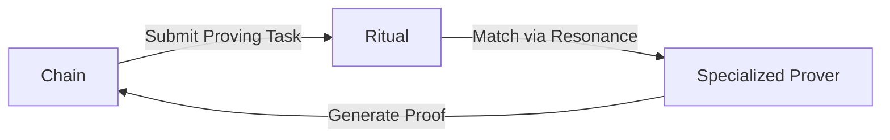

> ## Documentation Index
> Fetch the complete documentation index at: https://ritualfoundation.org/docs/llms.txt
> Use this file to discover all available pages before exploring further.

# Prover Networks

> Resonance and Symphony enable drop-in decentralization and real-time optimization for L2s, ZKML coprocessors, and other proof-backed networks.

<Frame>
  <video src="https://mintcdn.com/ritualfoundation/sxqQxm2wyqht7Z65/assets/videos/provers.mp4?fit=max&auto=format&n=sxqQxm2wyqht7Z65&q=85&s=4d92236920021b416dad572fc5135c36" autoPlay controls disablePictureInPicture loop playsInline muted preload="auto" data-path="assets/videos/provers.mp4" />
</Frame>

## The Proving Challenge

Zero-knowledge (ZK) proof systems are becoming central to blockchain scalability
and privacy. From ZK-rollups to privacy-preserving applications, the demand for
efficient proof generation and verification is high. However, these systems face
challenges:

* **Computational Intensity**: Proof generation is resource-intensive, often
  requiring specialized hardware
* **Latency**: Sequential proof generation can create bottlenecks in transaction
  processing
* **Cost**: Operating dedicated proving infrastructure is expensive and often
  inefficient
* **Decentralization**: Maintaining a decentralized network of provers while
  ensuring reliable execution is complex

***

## Ritual as a Prover Network

Ritual's architecture provides a natural solution to these challenges, enabling
chains to outsource their proving needs while maintaining security and
decentralization:

### Efficient Proof Generation

Through [Resonance](/architecture/resonance), Ritual enables:

* **Specialized Hardware Matching**: Transactions requiring proof generation are
  automatically matched with nodes with optimal hardware configurations (GPUs,
  FPGAs)
* **Dynamic Pricing**: Proof generation costs are determined through
  surplus-maximizing market mechanisms, ensuring efficient resource allocation
* **Parallel Processing**: Multiple proofs can be generated simultaneously by
  different specialized nodes
* **Hardware Flexibility**: Support for diverse hardware accelerators without
  protocol-level changes

### Decentralized Verification

[Symphony](/architecture/symphony)'s EOVMT (Execute-Once-Verify-Many-Times)
protocol is a state-of-the-art proof-first consensus protocol, that can be
borrowed by chains to reduce replicated execution and enable high-performance,
resource-intensive workloads:

* **Distributed Trust**: Proofs are verified by a quorum of validator nodes
* **Scalable Verification**: Sub-proofs can be verified in parallel, reducing
  latency
* **Resource Optimization**: Only a subset of validators needs to verify each
  proof
* **Asynchronous Validation**: Support for out-of-order proof verification,
  crucial for architectures like MegaETH

### Example Flow

1. Chain submits a proving task to Ritual
2. Resonance matches the task with optimized proof generation nodes
3. Proof generation nodes return proofs to requesting chain

***

## Case Study: MegaETH

[MegaETH's architecture](https://www.megaeth.com/research) is a perfect example
of how modern chains can benefit from Ritual's prover network.

<Frame caption="MegaETH architecture. Notice how MegaETH's design demands the need for a prover network, operating asynchronously with specialized hardware, to generate streaming proofs of blocks and witnesses.">
  
</Frame>

Via Ritual, networks like MegaETH can outsource their proof generation to
specialized nodes, reducing operational overhead and ensuring reliable
execution:

1. Through [Resonance](/architecture/resonance), proof generation tasks can be
   matched with optimized nodes with specialized hardware, with efficient
   resource allocation.
2. Through [Symphony](/architecture/symphony), proof verification can be made
   asynchronous and distributed, ensuring high throughput.
3. Through [Ritual ↔︎ World](/architecture/ritual-to-world), MegaETH can tap
   into Ritual as a backend in a simple and transparent way.

### Integration Benefits

1. **Reduced Infrastructure Costs**: No need to maintain dedicated proving
   infrastructure
2. **Enhanced Decentralization**: Access to a diverse network of specialized
   provers
3. **Automatic Scaling**: Proving capacity scales with demand
4. **Future-Proof**: Support for new hardware accelerators as they emerge
